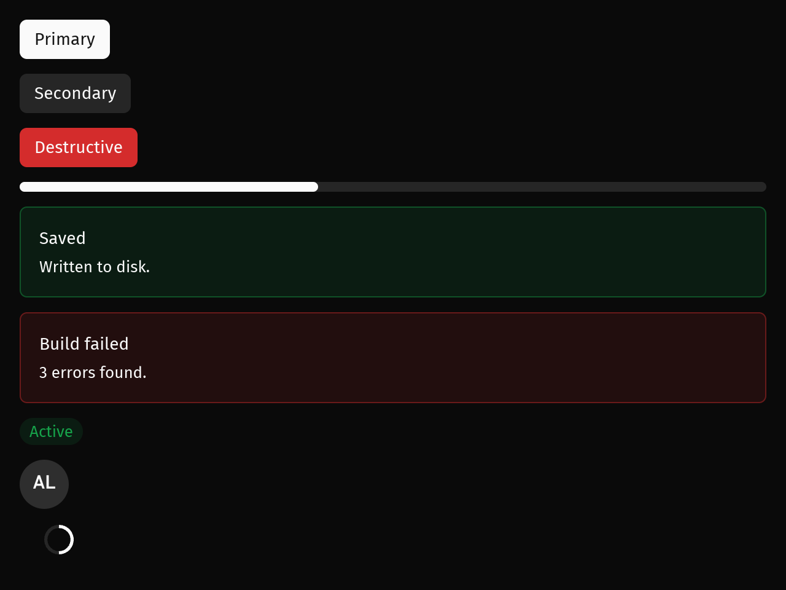
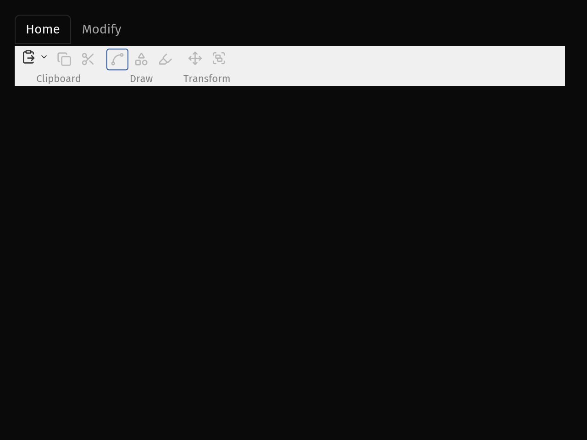
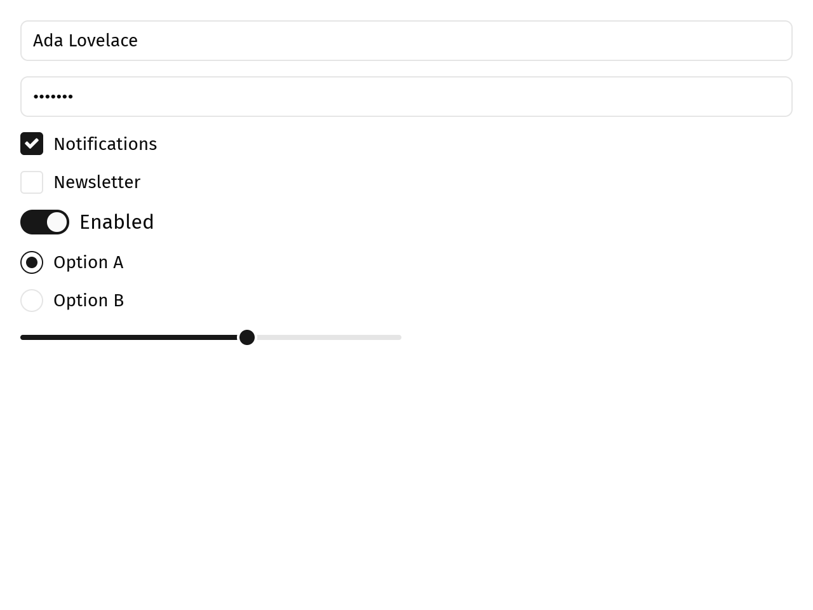

# iced-kit

基于 [iced](https://iced.rs/) 0.14 的 shadcn/ui 风格组件库与设计系统，移植自 [gpui-kit](https://github.com/longbridge/gpui-kit) 的视觉语言。

## 预览

| 浅色主题 | 深色主题 |
|:---:|:---:|
|  |  |

| 功能区 Ribbon（浅色） | 功能区 Ribbon（深色） |
|:---:|:---:|
|  |  |

## 核心理念

iced 0.14 的组件通过泛型 `Theme` 类型进行主题化。iced-kit 自带完整的语义 Token 体系，并为上游组件实现了 `Catalog` trait —— 因此无论是 iced 原生组件还是 iced-kit 组件，都能保持一致的视觉风格。

```rust
use iced_kit::Theme;

fn main() -> iced::Result {
    iced::application(App::new, App::update, App::view)
        .theme(App::theme)   // 返回 iced_kit::Theme
        .run()
}
```

## 设计 Token

| 分组 | 包含 |
| --- | --- |
| 颜色 | `background`, `foreground`, `surface`, `primary`, `secondary`, `muted`, `accent`, `destructive`, `warning`, `success`, `info`, `link`, `border`, `input`, `ring`, `selection` 及对应的 `*_foreground` |
| 圆角 | `none`, `sm`, `md`, `lg`, `xl`, `full` |
| 间距 | `xxs` … `xxl` |
| 排版 | `sans`, `mono`, 及 `xs`/`sm`/`md`/`lg`/`xl` 字号 |
| 尺寸 | `Xs`, `Sm`, `Md`, `Lg`, `Custom(px)` — 控制高度、内边距、图标和文字步进 |
| 动效 | `instant`, `fast`, `normal`, `slow`，及 `enter`/`exit`/`move` 曲线 |

## 组件一览

> 本项目提供 **100+ 个 UI 组件**，覆盖表单、显示、反馈、数据、图表、聊天、导航、功能区、浮层、Shell、设置、动效等全部场景。

| 分类 | 数量 | 关键组件 |
|------|:---:|----------|
| 表单控件 | 22 | Button, TextInput, ComboBox, DatePicker, ColorPicker |
| 表单布局 | 2 | Form, Field |
| 显示组件 | 18 | Card, Badge, Alert, Tree, Rating |
| 反馈组件 | 7 | Spinner, Skeleton, Shimmer, Collapsible |
| 数据展示 | 5 | VirtualList, DataTable, Markdown |
| 图表 | 7 | LineChart, BarChart, PieChart, CandlestickChart, SankeyChart |
| 聊天组件 | 6 | Bubble, Message, Attachment, MessageScroller |
| 导航组件 | 9 | Tabs, Accordion, Sidebar, Carousel, Stepper, Ribbon |
| 浮层与对话框 | 14 | Modal, Drawer, Toast, Dropdown, Popover, Tooltip |
| Docking 停靠 | 3 | Dock, Resizable, TitleBar |
| 设置面板 | 5 | Settings, SettingPage, SettingGroup, SettingItem, SettingField |
| 排版与头像 | 8 | Heading, Code, Avatar, Kbd |
| 图标 | 1000+ | Lucide 图标字体全套 |
| 动效 | — | Presence + 全组件内置动画 |

### 表单控件（22 个）

按钮（11 种变体）、图标按钮、按钮组、下拉按钮、切换按钮（Toggle）、切换组（ToggleGroup）、文本输入、密码输入、多行文本、输入组、选择器、可搜索选择器、组合框（多选+过滤面板）、复选框、单选框、开关（Switch）、滑块、数字输入、OTP 输入、日历、日期选择器、颜色选择器。




| 下拉选择 | 组合框 | 日历 | 颜色选择器 |
|:---:|:---:|:---:|:---:|
|  |  |  |  |

| 数字/OTP 输入 | 密码输入 | 文本域 |
|:---:|:---:|:---:|
|  |  |  |

### 表单布局（2 个）

`form`/`field` 将带标签的控件排列为表单：支持纵向或横向标签放置、`columns` 网格布局与 `col_span`/`col_start`/`col_end` 定位、`required` 标记、muted 描述行，以及底部操作区。


### 显示组件（18 个）

卡片、分组框、分割线、垂直分割线、水平分隔线（带标签/虚线）、Badge（标签/圆点/计数/图标形式）、进度条、Alert（横幅形式+关闭按钮）、空状态、标签、Tag、头像组（重叠+溢出标记）、Label Builder（掩码值+搜索高亮）、描述列表、链接、剪贴板按钮、评分、树形控件。


### 反馈组件（7 个）

Spinner（弧形和圆点）、环形进度、骨架屏、骨架列表项、骨架表格、折叠面板、Shimmer（文本/区块/任意元素，可配置扫过方向）。


### 数据展示（5 个）

列表、ListItem、VirtualList（可变高度虚拟化）、DataTable（可排序、虚拟化、分组标题、固定列、骨架加载状态）、Markdown。


### 图表（7 种）

折线图、面积图（叠加/堆叠）、柱状图（分组/堆叠，四种方向）、饼图（饼/环）、雷达图、K 线图、桑基图。所有图表共享悬停十字线、数据提示、刻度映射和主题色彩体系。


### 聊天组件（6 个）

气泡（7 种表面样式+反应胶囊）、消息（头像/编号+头部+内容+底部）、消息组、标记（普通/分隔/边框，加载动画）、附件（5 种上传状态+预览+操作行）、消息滚动器（虚拟化、跟随尾部、底部渐隐、跳转最新）。


### 导航组件（9 个）

标签页（下划线/标签/轮廓/胶囊/分段五种风格，支持尺寸和图标插槽）、手风琴（多项展开/带边框/尺寸/图标）、面包屑、步骤条（水平/垂直，标记完成状态）、应用菜单栏、分页、轮播（水平/垂直，前后控制/圆点指示/循环/键盘/拖拽吸附）、侧边栏（可折叠面板，带头部/分组菜单/底部；三种折叠模式，动画宽度过渡，可拖拽调整宽度，子菜单，Badge，折叠态工具提示）、Ribbon 功能区（见下）。


### 功能区 Ribbon

Ribbon 是一个分带的命令工具栏：顶部一排标签页，标签页下方为若干**分组**，每组是带底部标签的一簇工具按钮。工具分为大号（整列高，图标在上、文字在下）与小号（单行，纯图标或图标加文字）两种足迹，两者都能带一个 ▾ 打开相关命令的下拉面板。

除核心的标签/分组/工具模型外，Ribbon 还具备完整的 SARibbon 风格功能：

- **10 种内置主题** — Office 2013、Office 2016 Blue/Green/Dark、Office 2021 Blue/Green/Dark、Windows 7 以及两种深色变体。每种主题定义各自的强调色、标签栏、分组背景、按钮悬停和边框颜色，可通过 `RibbonTheme` 在运行时切换。
- **6 种面板布局** — 松散/紧凑 × 三行/两行/单行，外加自适应 `Auto` 模式。布局作为 `RibbonState` 中的纯数据，可由选择器实时切换。
- **快速访问栏** — 标签页上方的一行小图标按钮，用于放置最常用命令。
- **Gallery 样式库** — Office 风格的可视化项目网格（样式预设、图表预览），内嵌于分组中。
- **上下文标签页** — 带各自强调色的条件性标签页，渲染在常规标签页旁。
- **最小化模式** — 折叠为仅显示标签栏。
- **动态标签页** — 在运行时添加和删除标签页与面板。
- **分离式动作按钮** — 主体执行动作、箭头打开菜单的按钮。

Ribbon 完全由数据描述（`RibbonTab` → `RibbonGroup` → `RibbonItem` → `RibbonTool`），每帧重建；当前标签、打开的下拉、主题和布局等状态由调用方持有的 `RibbonState` 承载，组件只通过 `on_select`/`on_dropdown_toggle` 上报意图，自身不做任何修改。下拉面板不由 Ribbon 绘制，而是经 `overlay::trigger` 上报按钮自身矩形后由应用托管，与组合框/日期/颜色选择器面板同源。

### 完整窗口演示

`main_window` 示例展示了 Ribbon 在完整 SARibbon 风格应用中的效果——着色标题栏承载应用按钮、快速访问栏、标签页、主题与布局选择器以及窗口控制；中央日志区域；底部状态栏。运行方式：`cargo run --example main_window`。


当分组宽度超出可用空间时，命令带会**从右向左逐级降级**：完整 → 紧凑图标列 → 标题按钮 → 紧凑小图标按钮，行高随之收缩（`CollapseMode::Auto`）；其余档位则把所有分组钉在同一密度。

```rust
use iced_kit::widgets::ribbon::{Ribbon, RibbonGroup, RibbonItem, RibbonState, RibbonTab, RibbonTool};

Ribbon::new()
    .tab(RibbonTab::new("Home").group(
        RibbonGroup::new("Draw")
            .item(RibbonItem::large(RibbonTool::new("／").label("Line")))
            .item(RibbonItem::tool(RibbonTool::new("▢").label("Rectangle"))),
    ))
    .state(&state)
    .on_select(Message::Selected)
    .into()
```


### 浮层与对话框（14 个）

Modal、Dialog、AlertDialog、Drawer、Sheet（标题栏下方停驻）、Toast/Toasts、Dropdown/MenuItem、ContextMenu、Popover、HoverCard（悬停打开）、Tooltip（可指定快捷键）。支持 `trigger` 锚点机制，让面板精确定位到触发器位置。


| 弹出层 | 右键菜单 | 警告对话框 | 工具提示 |
|:---:|:---:|:---:|:---:|
|  |  |  |  |

### Docking 停靠布局（`dock` feature，3 个）

完整的可停靠布局系统：可拖拽标签、嵌套分割、拖放目标、可折叠边缘 Dock 和面板缩放。


### 设置面板（5 个）

搜索侧边栏 + 页面/分组/条目/字段四级结构，支持 Switch、Checkbox、文本、数字步进、下拉选择和自定义字段。面板可拖拽调整大小。


### 排版与头像（8 个）

标题、段落、辅助文本、代码、键盘按键标记、快捷键组合、头像、带头像的名称。


### 图标（Lucide 全套 1000+ 图标）

集成 [Lucide](https://lucide.dev) 全套图标字体，通过 `IconName` 枚举直接使用，无需手动管理 SVG 文件。


### 动效（Presence + 全组件内置动画）

所有表面都有入场/出场动画：Drawer 从边缘滑入、Dialog 升起、Dropdown 下落、Toast 从角落进入。标签指示器在标签间滑动、折叠面板展开动画、进度条缓动、骨架屏呼吸效果。

## 快速上手

```toml
# Cargo.toml
[dependencies]
iced-kit = "0.1"

# 启用 Dock 功能
iced-kit = { version = "0.1", features = ["dock"] }
```

```rust
use iced_kit::prelude::*;
use iced_kit::Theme;

fn view(&self) -> Element<'_, Message, Theme> {
    column![
        heading("Hello iced-kit"),
        button("Save").primary().on_press(Message::Save),
        badge("Active", Tone::Success),
        alert("Saved", "Your changes were written.", Tone::Success),
    ]
    .spacing(16)
    .padding(24)
    .into()
}
```

## 运行示例

```sh
# 组件画廊
cargo run --example gallery

# 深色模式启动
GALLERY_DARK=1 cargo run --example gallery

# Ribbon 功能区示例
cargo run --example ribbon

# Dock 布局示例
cargo run --example dock --features dock
```

## 开发

```sh
cargo fmt --check
cargo clippy --all-targets -- -D warnings
cargo clippy --all-targets --features dock -- -D warnings
cargo test
cargo test --features dock
```

## 文档

- [THEMING.md](THEMING.md) — 自定义 Token、组件样式覆盖
- [docs/COMPONENTS.zh-CN.md](docs/COMPONENTS.zh-CN.md) — 中文组件使用文档

## 致谢

设计语言、Token 模型和组件命名来自 [gpui-kit](https://github.com/longbridge/gpui-kit)（Apache-2.0）和 [shadcn/ui](https://ui.shadcn.com/)。实现参考了 [iced-astraui](https://github.com/AstraBrew-Labs/iced-astraui) 和 [iced-shadcn](https://github.com/FerrisMind/shadcn-rs)（均为 MIT）。

## 许可证

MIT OR Apache-2.0
